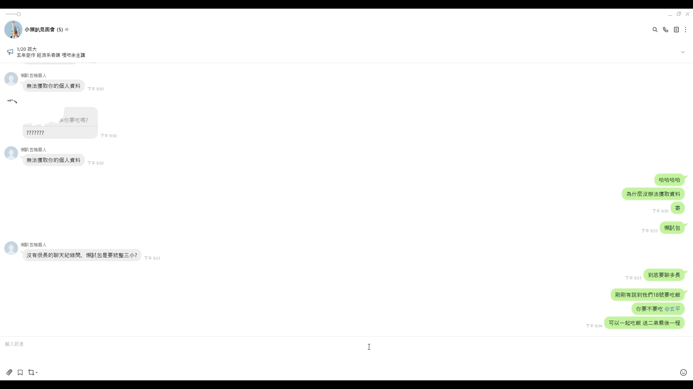

# Line Bot Chat Summary with LLM


## Project Introduction

This project integrates **Line Bot** with **LLM** (Large Language Model) capabilities to automatically consolidate and summarize chat records from **Line**. When a user types **"懶趴包"** in a **Line** group, the system triggers the chat record consolidation and summarization function, returning a concise summary of the conversation.

## Features

- **Automated Chat Record Summarization**: When the user inputs the keyword `"懶趴包"`, the system automatically consolidates and summarizes the chat records.

## Installation Guide

Follow the steps below to install and run the project:

### 1. Clone the Project

```bash
git clone https://github.com/your-repo/line-bot-summary.git
cd line-bot-summary
```
### 2. Start the Service
```bash
# Start the environment
docker-compose -f ./docker-compose.yml up

# Stop the environment
docker compose down
```

### 3. Prepare the Model

* The default model is Llama-3-Taiwan-8B-Instruct (https://huggingface.co/yentinglin/Llama-3-Taiwan-8B-Instruct).
* Use Ollama (https://github.com/ollama/ollama) for managing the model.
* Convert the model into the gguf format using llama.cpp (https://github.com/ggerganov/llama.cpp).

### 4. Use ngrok to Obtain SSH and Public Domain
  Install and set up ngrok (https://ngrok.com/).
Use ngrok to expose your local server to the internet and obtain both SSH access and a public domain for webhook integration.
### 5. Register a Line Official Bot and Obtain Webhook Secret and Token
   Visit the Line Developers website (https://developers.line.biz/en/docs/).
Register a new Line Official Account.
Set up a bot and retrieve its Webhook Secret and Access Token from the account settings.